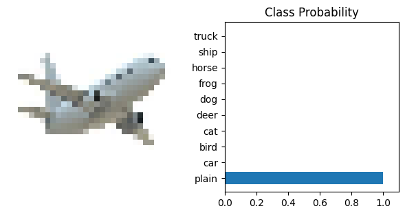

# CIFAR-10 Classification Scripts

This repository contains simple scripts to train and run predictions for CIFAR-10 using multiple model architectures (SimpleCNN, ResNet18, MobileNetV2). It is designed to be easy to run locally and commit to GitHub.

Models included: ResNet18, MobileNetV2, and a custom DeepNN (SimpleCNN) implemented in `scripts/models.py`.

## Files added
- `scripts/models.py` - model definitions and a `get_model(name, num_classes)` helper.
- `scripts/utils.py` - data transforms, dataloaders and class labels.
- `scripts/train.py` - training script (saves checkpoints to `./models`).
- `scripts/predict.py` - run per-image predictions in a folder and write `predictions.csv`.
- `requirements.txt` - Python dependencies.
- `.gitignore` - recommended ignores.

## Single-image example

You can run single-image classification using `scripts/predict.py`. For a simple visual reference this repo includes a placeholder example image shown below. Replace `assets/example.svg` (or add your own `assets/example.jpg` / `assets/example.png`) when you want to show a real sample.



To classify a single image (put it in `./images` or set `--input-folder`):

```powershell
python .\scripts\predict.py --checkpoint .\models\resnet18_best.pth --input-folder .\images --output predictions.csv --model resnet18 --device cpu
```

If you prefer passing a single image file path directly, add it to the `images/` folder and the script will process it (one row in `predictions.csv`).

## Quick start (Windows PowerShell)

1. Create and activate a virtual environment

```powershell
python -m venv .venv
.\.venv\Scripts\Activate.ps1
```

2. Install dependencies

```powershell
pip install -r requirements.txt
```

3. Train a model (example)

```powershell
python .\scripts\train.py --model resnet18 --epochs 10 --batch-size 128 --device cpu
```

Checkpoints will be saved in `./models` (e.g., `resnet18_best.pth`).

4. Predict on a folder of images

```powershell
python .\scripts\predict.py --checkpoint .\models\resnet18_best.pth --input-folder .\images --output predictions.csv --model resnet18 --device cpu
```

`predictions.csv` will contain one row per image with the predicted CIFAR-10 class and probability.

## Notes and next steps
- The training script downloads CIFAR-10 into `./data` by default.
- For GPU training, use `--device cuda` if CUDA is available.
- You can add more architectures in `scripts/models.py` and tune transforms in `scripts/utils.py`.

